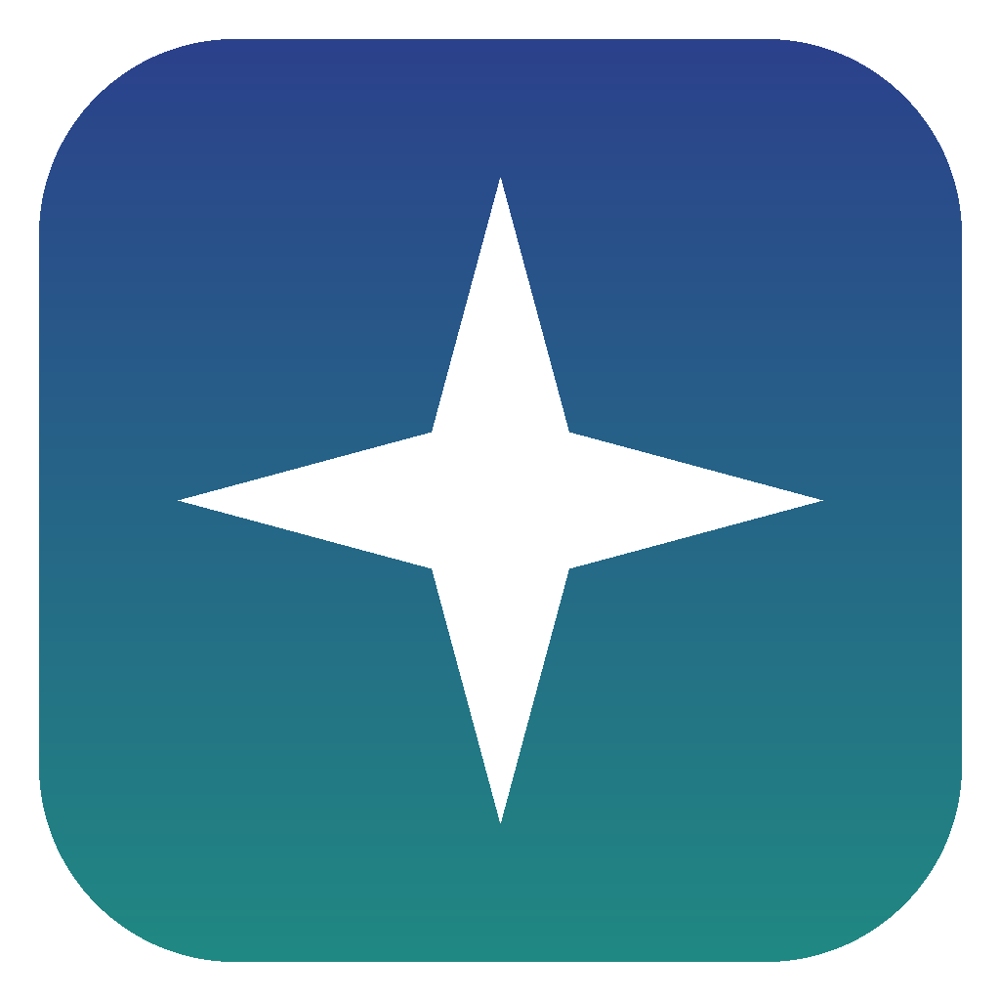

<div align="center">
  

  <h1>Free Realms Evergrove</h1>

  <p>A community server for Free Realms, built around creative housing.</p>

  <p>
    <a href="https://github.com/Lxzxrus/Free-Realms-Server/releases/latest"><strong>Download the launcher</strong></a>
    ·
    <a href="https://discord.gg/5kX5hh7skx">Discord</a>
    ·
    <a href="https://github.com/Lxzxrus/Free-Realms-Server/issues">Report a bug</a>
  </p>
</div>

Free Realms Evergrove is a fan-run server for Free Realms, the free-to-play game Sony Online Entertainment ran from
2009 to 2014. It runs **Sanctuary**, the [Open Source Free Realms](https://github.com/Open-Source-Free-Realms/Sanctuary)
server emulator, with our own work on top.

- **Creative housing:** a free lot for everyone and 1,700+ building pieces in every colour, with search in the
  Decorate panel. Visit friends' homes, or publish yours to the housing directory.
- **Membership for everyone:** there is nothing to buy.
- Quests, trading, chat and more, with new content as volunteers make it.

## Playing

1. Download the launcher from the [latest release](https://github.com/Lxzxrus/Free-Realms-Server/releases/latest):
   `EvergroveLauncher-win-Setup.exe` on Windows, `EvergroveLauncher.AppImage` on Linux. The installer isn't
   code-signed, so Windows may warn you the first time: **More info**, then **Run anyway**.
2. Register with the button under the login form, then press **Play**. The first time, the launcher downloads the
   official Free Realms client (about 850 MB). If you already have one, the **+** button uses that folder instead.
3. Before every launch the launcher checks the game against the official client, and repairs anything changed or
   missing. Launcher updates come from this page: the arrows button at the top.

## What's in this repository

| Folder | What |
|---|---|
| `src/` | The server: Login, Gateway (the game world), WebAPI (accounts) and the game logic. C#/.NET |
| `launcher/` | The launcher, a fork of OSFR's ([launcher/README.md](launcher/README.md)) |
| `docs/` | Design, security and operations notes. [docs/webapi.md](docs/webapi.md) covers running WebAPI behind HTTPS |
| `tools/` | The client mod behind the housing search, and the asset mirror |

## Running your own server

This repository only contains the server. To play you also need the Free Realms client; the launcher downloads it
from Open Source Free Realms.

```bash
cd src && dotnet restore && dotnet build --no-restore && dotnet test --no-build
```

You need the .NET 10 SDK and the .NET 9 runtime; the MySQL test needs a running MariaDB.

### Local settings

Login, Gateway and WebAPI each read a git-ignored local settings file after their tracked one, and environment
variables override both (`"Server": { "Port": … }` becomes `Server__Port`). Copy the example beside each project
and edit the copy; the example documents every setting:

| Server | Copy | to |
|---|---|---|
| Login | `src/Sanctuary.Login/login.local.example.json` | `login.local.json` |
| Gateway | `src/Sanctuary.Gateway/gateway.local.example.json` | `gateway.local.json` |
| WebAPI | `src/Sanctuary.WebAPI/appsettings.local.example.json` | `appsettings.local.json` |

The build copies each local file next to its server.

- **Database:** `"Database": { "Provider": "Sqlite", "ConnectionString": "Data Source=sanctuary.db" }`, or MariaDB
  (`"Provider": "MySql"`), as Docker Compose uses (`src/Docker`, with `src/Docker/.env` from `.env.example`).
- **Required:** `Server:LoginGatewayChallenge`, the same random value for Login and Gateway
  (`openssl rand -base64 32`). Both refuse to start without it, or with OSFR's old public value.
- **Debug builds** refuse to start unless `"AllowDebugBuild": true` is set, because they skip login checks and make
  every player an Admin. Set it for a private test server only, never for one others can reach.
- **Starting values:** `StartingCoins`, `StartingStationCash`, `UnlockAllTitles` and `UnlockAllProfiles` in
  `login.local.json`, and `WebAPI:MemberByDefault` in `appsettings.local.json`. `docs/playtest-plan.md` has a
  playtest set.
- The Login server's Gateway port (20041) listens on `127.0.0.1` only. Change `Server:LoginGatewayBindAddress`
  only when the Gateway runs on another machine, and firewall the port to that machine.

Then start `Sanctuary.Login`, `Sanctuary.Gateway` and `Sanctuary.WebAPI`, and point a launcher at the server
([launcher/server/README.md](launcher/server/README.md)).

### A public server

WebAPI (accounts, login and portraits) must sit behind HTTPS: [docs/webapi.md](docs/webapi.md) covers Caddy, rate
limits and lockouts. [launcher/server/README.md](launcher/server/README.md) lists what the launcher needs from the
server, and [tools/asset-mirror](tools/asset-mirror/README.md) how to serve the game's streamed assets yourself.

## Credits

Evergrove stands on other people's work, all published under the AGPL:

- **[Open Source Free Realms](https://github.com/Open-Source-Free-Realms)**: Sanctuary, the server emulator this is
  built on, its launcher, and the official client download.
- **raisingkaines**: the housing system, from his Sanctuary fork.
- **JadenY**: the quest system, from Sulphural's fork.
- Everyone who contributed to Sanctuary upstream; the git history credits each of them.

## How it's made

Evergrove is developed openly with AI. Nate runs the project: he decides what gets built, tests every change in the
game client with playtesters, and merges it. Claude, Anthropic's AI, writes most of the code and documentation
under that direction, from reverse-engineering the 2009 client to the server fixes. Every commit Claude made says
so in a `Co-Authored-By: Claude` line, and pull requests say what was checked in the game and what wasn't.

## License

[GNU Affero General Public License v3.0](LICENSE). If you run a modified copy as a public server, the AGPL requires
you to offer its players the source.

Free Realms Evergrove is a fan project, not affiliated with or endorsed by Sony Online Entertainment or Daybreak
Game Company. Free Realms and its assets belong to their owners.
